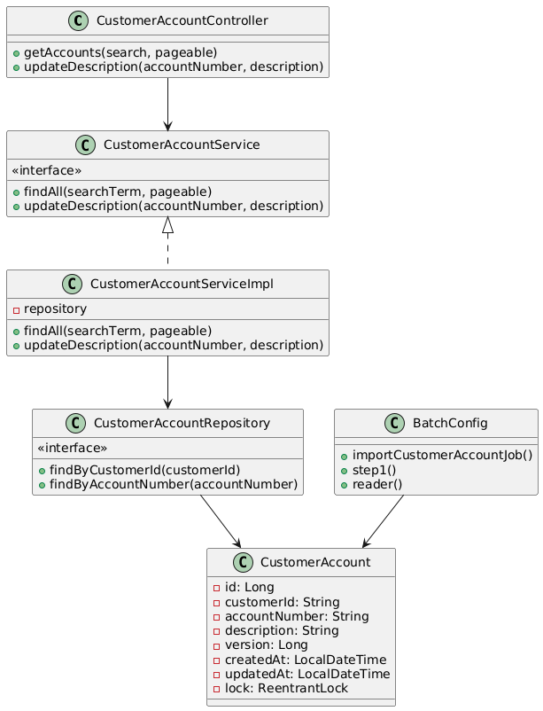
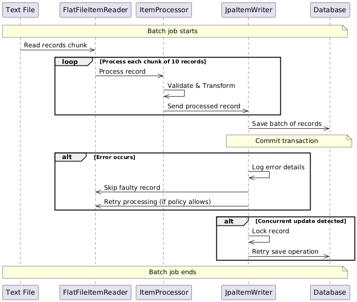

# Customer Account Management System

This project implements a customer account management system with features including batch processing, RESTful APIs, and concurrency handling. It adheres to best practices in software design and employs modern patterns and principles to ensure scalability, maintainability, and reliability.

---

## **Features**

1. **Batch Job**: Efficiently processes and imports customer accounts from a text file into the database.
2. **RESTful APIs**:
    - Retrieve paginated customer account data with search functionality.
    - Update account descriptions with concurrency handling.
3. **Concurrency Handling**:
    - Optimistic locking with `@Version`.
    - Explicit locking with `ReentrantLock`.
    - Retry mechanism using `@Retryable`.
4. **Design Principles**:
    - Adheres to SOLID principles.
    - Follows clean code practices.
    - Implements proper exception handling.
5. **Design Patterns**:
    - **Repository Pattern**: For data access abstraction.
    - **Service Layer Pattern**: Encapsulation of business logic.
    - **DTO Pattern**: For API response mapping.
    - **Factory Pattern**: Used in Spring configuration.
    - **Strategy Pattern**: Batch processing with reader, processor, and writer.

---

## **Architecture Overview**



### **Class Diagram**
```mermaid
    class CustomerAccountController {
        +getAccounts(search, pageable)
        +updateDescription(accountNumber, description)
    }
    
    class CustomerAccountService {
        <<interface>>
        +findAll(searchTerm, pageable)
        +updateDescription(accountNumber, description)
    }
    
    class CustomerAccountServiceImpl {
        -repository
        +findAll(searchTerm, pageable)
        +updateDescription(accountNumber, description)
    }
    
    class CustomerAccountRepository {
        <<interface>>
        +findByCustomerId(customerId)
        +findByAccountNumber(accountNumber)
    }
    
    class CustomerAccount {
        -id: Long
        -customerId: String
        -accountNumber: String
        -description: String
        -version: Long
        -createdAt: LocalDateTime
        -updatedAt: LocalDateTime
        -lock: ReentrantLock
    }
    
    class BatchConfig {
        +importCustomerAccountJob()
        +step1()
        +reader()
    }
    
    CustomerAccountController --> CustomerAccountService
    CustomerAccountService <|.. CustomerAccountServiceImpl
    CustomerAccountServiceImpl --> CustomerAccountRepository
    CustomerAccountRepository --> CustomerAccount
    BatchConfig --> CustomerAccount
```

### **Sequence Diagram**



```mermaid
@startuml
    participant File as "Text File"
    participant Reader as "FlatFileItemReader"
    participant Processor as "ItemProcessor"
    participant Writer as "JpaItemWriter"
    participant DB as "Database"
    
    Note over File,DB: Batch job starts
    File->>Reader: Read records chunk
    loop Process each chunk of 10 records
        Reader->>Processor: Process record
        Processor->>Processor: Validate & Transform
        Processor->>Writer: Send processed record
    end
    Writer->>DB: Save batch of records
    Note over Writer,DB: Commit transaction
    
    alt Error occurs
        Writer->>Writer: Log error details
        Writer->>Reader: Skip faulty record
        Writer->>Reader: Retry processing (if policy allows)
    end
    
    alt Concurrent update detected
        Writer->>Writer: Lock record
        Writer->>DB: Retry save operation
    end
    Note over File,DB: Batch job ends
@enduml

```

---

## **Technology Stack**

- **Programming Language**: Java
- **Frameworks**: Spring Boot, Spring Batch
- **Database**: PostgreSQL
- **Database Migration**: FLyway
- **Build Tool**: Gradle
- **Testing Framework**: JUnit 5, Mockito
- **Logging**: SLF4J, Logback

---

## **Project Setup Instructions**

### **Prerequisites**
1. Java 17 or higher.
2. Gradle 8.11.1 or higher.
3. PostgreSQL database.
4. IDE (e.g., IntelliJ IDEA or Eclipse).

### **Steps to Run the Project**
1. Clone the repository:
   ```bash
   git clone <repository-url>
   ```
2. Navigate to the project directory:
   ```bash
   cd customer-account-management
   ```
3. Update the database configuration in `src/main/resources/application.properties`:
   ```properties
   spring.datasource.url=jdbc:postgresql://localhost:5432/your_database
   spring.datasource.username=your_username
   spring.datasource.password=your_password
   spring.jpa.hibernate.ddl-auto=update
   ```
4. Build the project:
   ```bash
   gradle clean install
   ```
5. Run the application:
   ```bash
   gradle spring-boot:run
   ```
6. Access the APIs:
    - Retrieve Accounts: `GET /api/v1/accounts?page=0&size=10`
    - Update Description: `PATCH /api/v1/{accountNumber}/description`

### **Testing**
Run unit tests:
```bash
mvn test
```

---

## **REST API Features**

1. **Retrieve Accounts**:
    - URL: `/api/v1/accounts`
    - Method: `GET`
    - Query Parameters: `search`, `page`, `size`.
    - Response: Paginated list of customer accounts.

2. **Update Description**:
    - URL: `/api/v1/{accountNumber}/description`
    - Method: `PATCH`
    - Payload: `description` (string).

---

## **Design Principles**

1. **Single Responsibility Principle**: Each class has a single well-defined purpose.
2. **Open-Closed Principle**: The system is extensible without modifying existing code.
3. **Dependency Injection**: Managed by Spring, ensuring loose coupling.
4. **Clean Code**: Readable, maintainable, and well-documented code.

---

## **Design Patterns**

1. **Repository Pattern**: Abstracts database interactions.
2. **Service Layer Pattern**: Encapsulates business logic.
3. **DTO Pattern**: Separates API response models from entities.
4. **Factory Pattern**: Utilized in Spring configuration beans.
5. **Strategy Pattern**: Implements reader, processor, and writer in batch jobs.

---

## **Error Handling and Concurrency**

1. **Optimistic Locking**:
    - Ensures data integrity during concurrent updates.
    - Managed via the `@Version` annotation in `CustomerAccount`.

2. **Retry Mechanism**:
    - Handles transient failures during updates.
    - Configured using `@Retryable` annotation.

3. **Explicit Locking**:
    - `ReentrantLock` ensures thread safety during batch updates.

---

## **Logging**
- Log levels: DEBUG, INFO, WARN, ERROR.
- Batch processing logs successes and failures for traceability.
- Update API logs retries and conflicts.

---

## **Future Enhancements**
1. Add authentication and authorization (e.g., Spring Security, OAuth2).
2. Implement API rate limiting.
3. Add support for additional batch input formats (e.g., CSV, JSON).
4. Create a frontend dashboard for visualization and management.
